###CSC420 Assignment 2

###### Q1

#####Functions see file a2q1.py.

a)

Result image with 1D linear interpolation:

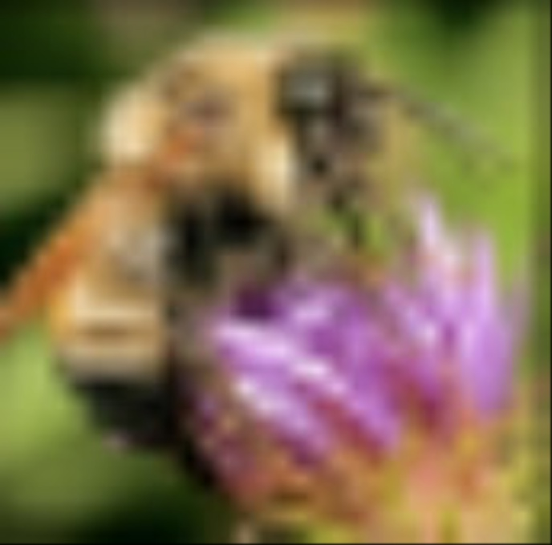

with $d = 1$, and 1D filter: 
$$
h = \left[ {\begin{array}{cc}
   0 & 0.25 & 0.5 & 0.75 & 1 & 0.75 & 0.5 & 0.25 & 0
  \end{array} } \right].
$$
We can do the same operation with 2D filter:
$$
\left[ {\begin{array}{cc}
   0 & 0 & 0 & 0 & 0 & 0 & 0 & 0 & 0\\
   0 & 0.0625 & 0.125 & 0.1875 & 0.25 & 0.1875 & 0.125 &0.0625 &0\\
   0 & 0.125 & 0.25 & 0.375 & 0.5 & 0.375 & 0.25 & 0.125 & 0\\
   0 & 0.1875 & 0.375 & 0.5625 & 0.75 & 0.5625 & 0.375 & 0.1875 & 0\\
   0 & 0.25& 0.5 & 0.75 & 1 & 0.75 & 0.5 & 0.25 & 0\\
   0 & 0.1875 & 0.375 & 0.5625 & 0.75 & 0.5625 & 0.375 & 0.1875 & 0\\
   0 & 0.125 & 0.25 & 0.375 & 0.5 & 0.375 & 0.25 & 0.125 & 0\\
   0 & 0.0625 & 0.125 & 0.1875 & 0.25 & 0.1875 & 0.125 & 0.0625 & 0\\
   0 & 0 & 0 & 0 & 0 & 0 & 0 & 0 & 0\\
  \end{array} } \right]=h^T*h
$$
b)

Result image with 2D linear interpolation:


with the same 2D filter in a), which is the:

General 1D fiter with d: 
$$
h = \left[ {\begin{array}{cc}
   0 & \frac1d & ... & \frac{d-1}d & 1 & \frac{d-1}d & ... & \frac1d & 0
  \end{array} } \right].
$$
And general 2D filter is:
$$
\left[ {\begin{array}{cc}
   0 & 0 & ... & 0 & 0 & 0 & ... & 0 & 0\\
   0 & \frac1{d^2} & \frac2{d^2} & ... & \frac1d & ... & \frac2{d^2} & \frac1{d^2} &0\\
   0 & \frac2{d^2} & \frac4{d^2} & ... & : & ... & \frac4{d^2} & \frac2{d^2} & 0\\
   0 & : & ... & \frac{{d-1}^2}{d^2} & \frac{d-1}d & \frac{{d-1}^2}{d^2} & ... & : & 0\\
   0 & \frac1d & ... & \frac{d-1}d & 1 & \frac{d-1}d & ... & \frac1d & 0\\
   0 & : & ... & \frac{{d-1}^2}{d^2} & \frac{d-1}d & \frac{{d-1}^2}{d^2} & ... & : & 0\\
   0 & \frac2{d^2} & \frac4{d^2} & ... & : & ... & \frac4{d^2} & \frac2{d^2} & 0\\
   0 & \frac1{d^2} & \frac2{d^2} & ... & \frac1d & ... & \frac2{d^2} & \frac1{d^2} & 0\\
   0 & 0 & ... & 0 & 0 & 0 & ... & 0 & 0\\
  \end{array} } \right]=h^T*h.
$$

###### Q2

##### Functions see file a2q2.py.

a)
Tried $\alpha=0.15$.
Harris corner detector result image:

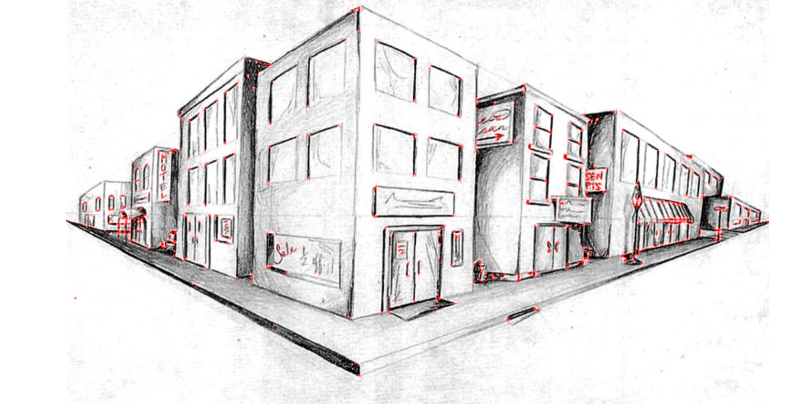

Harris corner detector result image with non-maximum suppression:

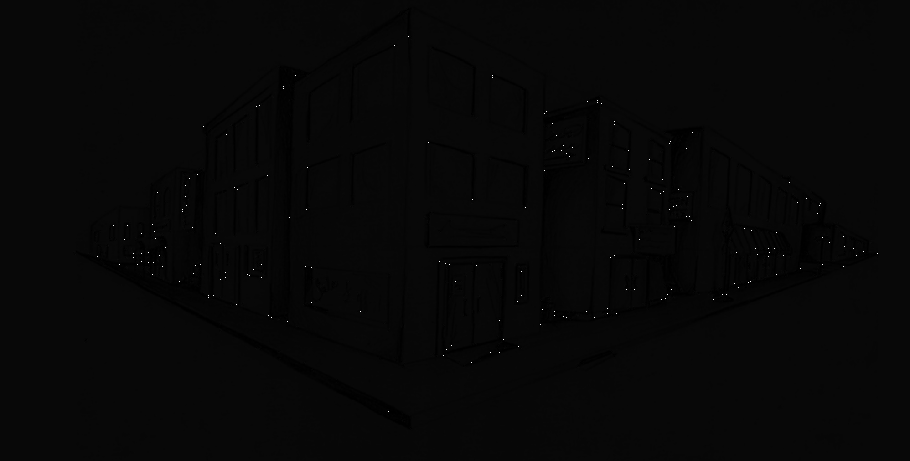

R matrix with Harris with $R =det(M) - \alpha \times trace(M)^2$, computed determinant and trace directly from gradients, with $\alpha = 0.05$:

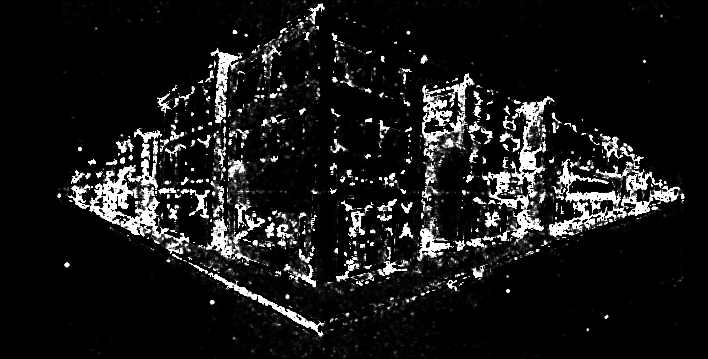

Harris corner detector with harmonic mean $R=\frac{det(M)}{trace(M)}$ , computed determinant and trace directly from gradients.

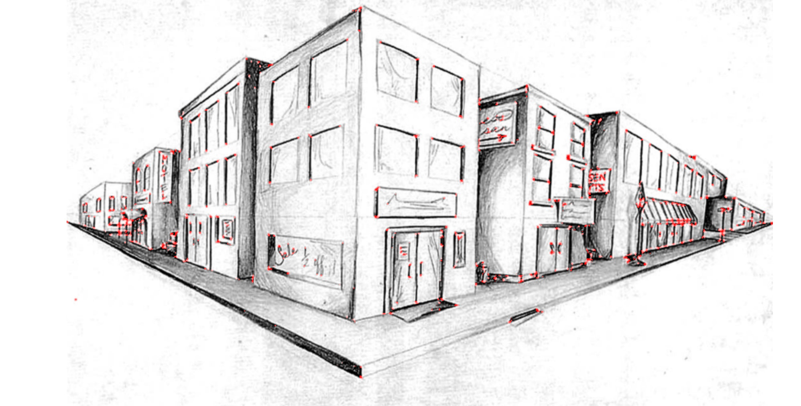

Harris corner detector result image with non-maximum suppression:

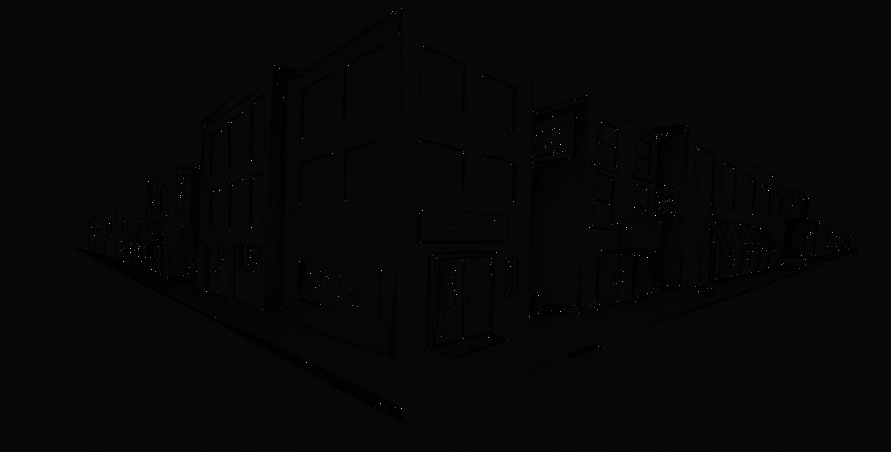

R matrix with harmonic mean:

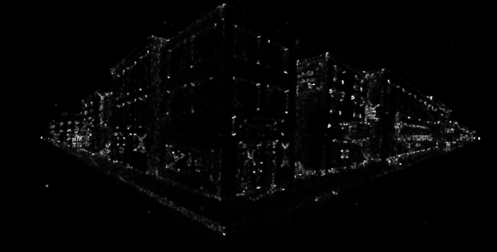

It is actually possible to compute "score" R for harris and with harmonic mean by computing two eigenvalues of matrix M. But this require looping through each pixel and solve a quadratic equation for each pixel. This will slow down the process and may have some computational error inside the eignvalue. Therefore, computing R by determinant and trace will give a faster detector.

b)

Rotated image is:

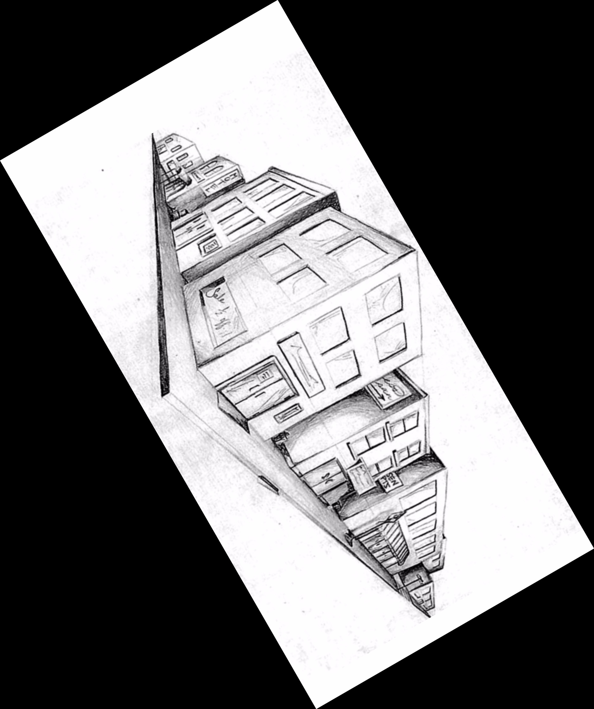

Corner detect on rotated image is:

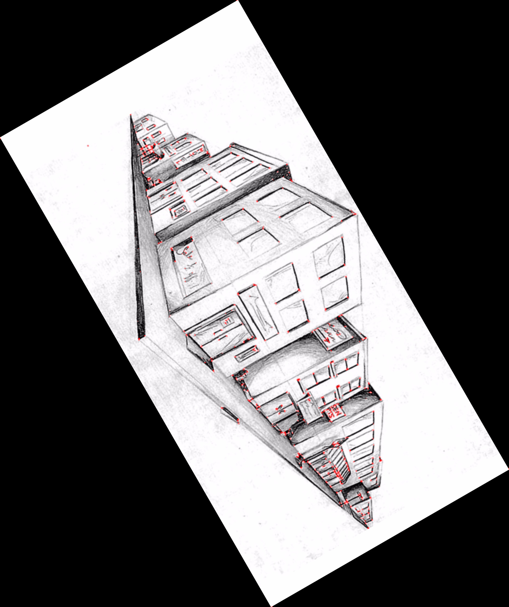

with nms:

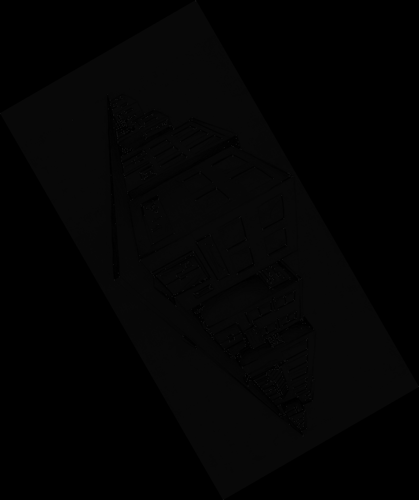

The corners also rotate by the same degree with image. Since corner formed by two edges and all thoses edges are rotated with same degree. Therefore, the angle will also rotated. And corners are rotation invariant features.

c)
Detect SIFT interest points with parameters: s = 3, $\sigma$ = 1.6, threshold = 0.3.
Result image:

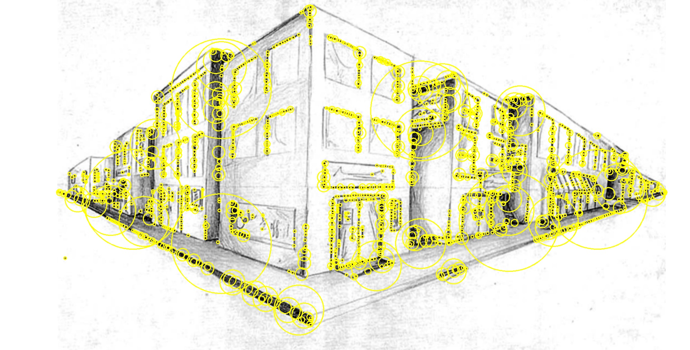

d)
**speeded up robust features** (**SURF**)

SUFT is like a speed up version of SIFT. The algorithm detect the feature by finding the Hessian matrix and computing the determinant of the matrix to find the location and the scale of the feature point. Since SUFT approximate some operations with box filter. And also SURF used up-scaled fiter by increasing the filter size to build a scaled pyramid. Therefore, the process is much faster than SIFT. 

Steps of SUFT algorithm to detect interest points:

- Compute integral image by applying box filter to compute sum of pixels inside the image.

- Construct Hessian matrix by use convolution operation with second order derivative of Guassian filter onto image and then compute the deternimant. Different scale is found by applying Gaussian with different $\sigma$. ($L_{xx}(p, \sigma)$ is computed by apply second derivative of Gaussian with $\sigma$ on to origin image at point p.) 
  $$
  H(p, \sigma) = \left[ {\begin{array}{cc}
     L_{xx}(p, \sigma) & L_{xy}(p, \sigma)\\
     L_{xy}(p, \sigma) & L_{yy}(p, \sigma)
    \end{array} } \right].
  $$
  
- Normalized determinant response and apply threshold  and non- maxima suppression.

- Compute interest points orientation by considering all orintations of the pixels inside a patch centered at the key point.

- Compute interest point descriptor in the similar way with SIFT.

###### Q3

a)

2D Gaussian function with $\mu_x=\mu_y=0$ is:
$$
g(x, y, \sigma)=\frac1{2\pi \sigma^2}e^{-(x^2+y^2)/(2\sigma^2)}.
$$
Then the first partial derivatives of Gaussian are:
$$
\frac{\partial g(x,y,\sigma)}{\partial x}=- \frac{x}{\sigma^2} \times\frac{1}{2\pi \sigma^2}e^{-(x^2+y^2)/(2\sigma^2)} =- \frac{x}{\sigma^2}g(x, y, \sigma),\\\frac{\partial g(x,y,\sigma)}{\partial y}=- \frac{y}{\sigma^2} \times\frac{1}{2\pi \sigma^2}e^{-(x^2+y^2)/(2\sigma^2)} =- \frac{y}{\sigma^2}g(x, y, \sigma).\\
$$
Then the second partial derivatives of Gaussian are:
$$
\frac{\partial^2 g(x,y,\sigma)}{\partial ^2x} =\frac{1}{\sigma^2}(\frac{x^2}{\sigma^2}-1)g(x, y, \sigma), \\\frac{\partial^2 g(x,y,\sigma)}{\partial ^2y} =\frac{1}{\sigma^2}(\frac{y^2}{\sigma^2}-1)g(x, y, \sigma). \\
$$
Therefore Laplacian of Gaussian is:
$$
\begin{aligned}\nabla^2g(x,y,\sigma) &= \frac{\partial^2 g(x,y,\sigma)}{\partial ^2x}+\frac{\partial^2 g(x,y,\sigma)}{\partial ^2y.} \\&= \frac1{\sigma^2}\big(\frac{x^2}{\sigma^2}+\frac{y^2}{\sigma^2}-2\big)g(x, y, \sigma) \\&= \frac1{\sigma^2}\big(\frac{x^2}{\sigma^2}+\frac{y^2}{\sigma^2}-2\big) \times\frac1{2\pi \sigma^2}e^{-(x^2+y^2)/(2\sigma^2)}\\&= \frac1{\pi\sigma^4}\big(\frac{x^2+y^2}{2\sigma^2}-1\big) e^{-(x^2+y^2)/(2\sigma^2)}.\end{aligned}
$$
LoG is not a separable filter.
e.g. matrix:
$$
\left[ {\begin{array}{cc}
   0 & -1 & 0\\
   -1 & 4 & -1\\
   0 & -1 & 0\\
  \end{array} } \right]
$$
is a commonly used Laplacian filter, but it is not  separable. Since we could not separate this matrix into the product of a column vector and a row vector.

b)

Compute partial derivative of Gaussion on $\sigma$,  With $\mu_x=\mu_y=0$:
$$
\begin{aligned}
\frac{\partial g(x,y,\sigma)}{\partial \sigma}&=-\frac1{\pi\sigma^3}e^{-(x^2+y^2)/(2\sigma^2)}+ \frac{x^2+y^2}{\sigma^3}\times \frac1{2\pi \sigma^2}e^{-(x^2+y^2)/(2\sigma^2)} \\
&= -\frac2\sigma g(x,y,\sigma) + \frac{x^2+y^2}{\sigma^3} g(x,y,\sigma) \\
&=\frac1\sigma\big(\frac{x^2}{\sigma^2}+\frac{y^2}{\sigma^2}-2\big) g(x,y,\sigma) \\
&=\sigma\times \nabla^2g(x,y,\sigma). 
\end{aligned}
$$
Since we could also approximate partial derivative of Gaussion with $\sigma_1$ on $\sigma$ by using difference of Gaussian of two near $\sigma$, $\sigma_1$ and $\sigma_2$, then we have:
$$
\frac{\partial g(x,y,\sigma_1)}{\partial \sigma} = \frac{g(x, y, \sigma_2)-g(x, y, \sigma_1)}{\sigma_2-\sigma_1}.
$$
Therefore:
$$
\begin{aligned}
g(x, y, \sigma_2)-g(x, y, \sigma_1) &= (\sigma_2-\sigma_1) \frac{\partial g(x,y,\sigma_1)}{\partial \sigma} \\
&= (\sigma_2-\sigma_1)\times\sigma_1 \nabla^2g(x,y,\sigma_1).
\end{aligned}
$$
So that DoG is LoG times some constant.
And:
$$
\frac{DoG}{LoG}=\frac{g(x, y, \sigma_2)-g(x, y, \sigma_1)}{\nabla^2g(x,y,\sigma_1)}=(\sigma_2-\sigma_1)\sigma_1.
$$
Smaller difference between $\sigma_2$and $\sigma_1$ will have a better approximation by making $(\sigma_2-\sigma_1)\sigma_1$ near 1.

######Q4

##### Functions see file a2q4.py.

a)
Find SIFT interest points by cv.SIFT().

```python
def find_sift_interest_points(source):
    gray = cv.cvtColor(source, cv.COLOR_BGR2GRAY)
    sift = cv.SIFT()

    # find the keypoints and descriptors with SIFT
    keypoint, descriptor = sift.detectAndCompute(gray, None)
    img = cv.drawKeypoints(source, keypoint, 			flags=cv.DRAW_MATCHES_FLAGS_DRAW_RICH_KEYPOINTS)
    return img
```

**Sample1.jpg** with SITF interest points:

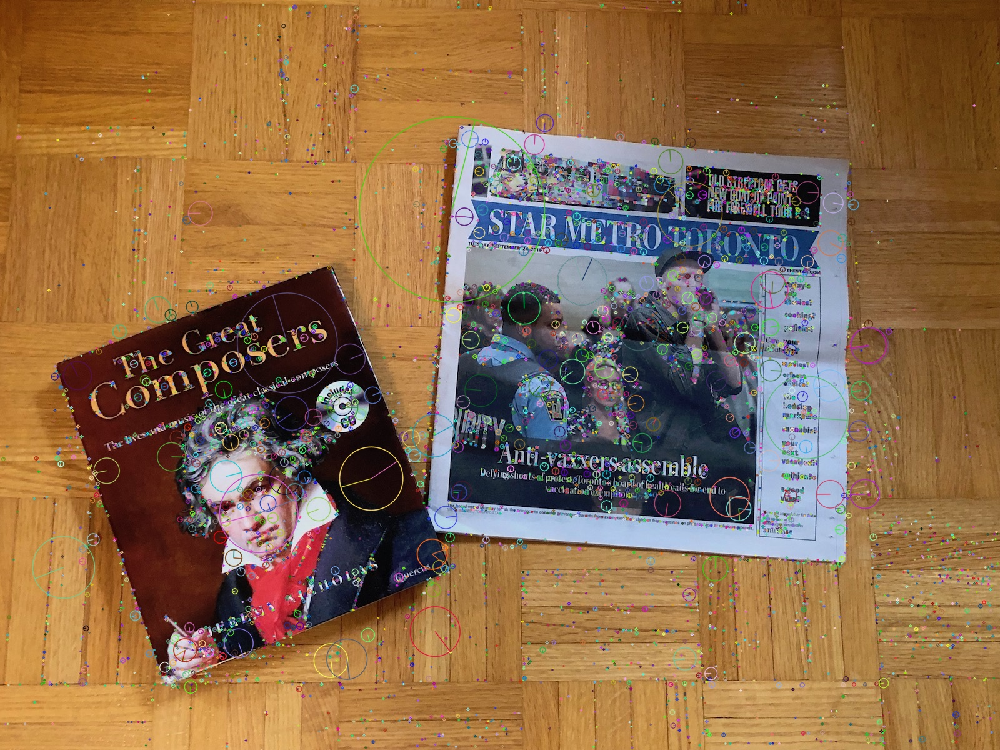

**Sample2.jpg** with SITF interest points:

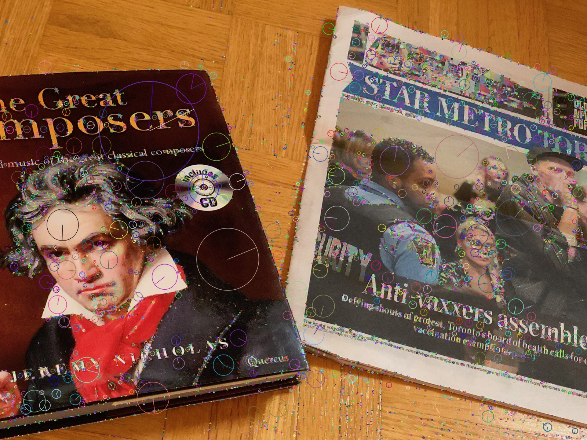

b)

Best ten matching result with the reliable ratio (0.8) amd 2- norm:

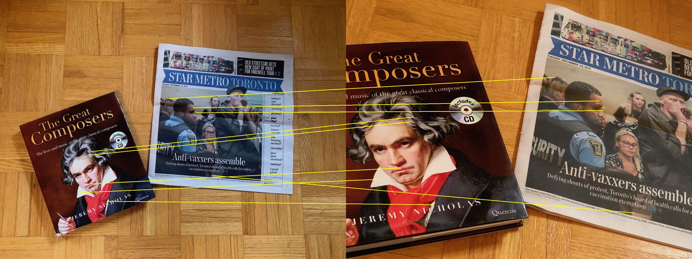


With threshold:

```
[0.2, 0.3, 0.5, 0.7, 0.8, 0.9]
```

Plot the ratio of number of matches/ total number of keypoints：

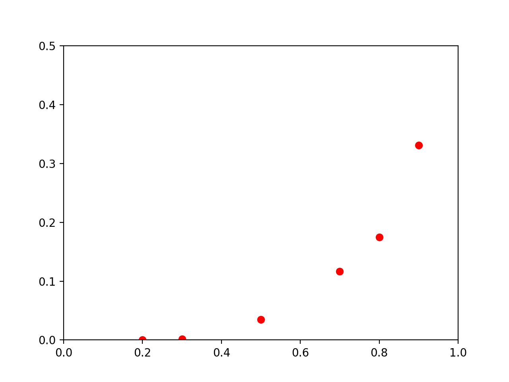

With experiment of sift matching with different threshold, plot the points as above. We can see that, if a really small threshold is applied, the matched keypoints is really small and even near 0 (for k = 0.2, 0.3). This will loss all the matches we want. But for a  really large threshold, near 0.4 features are matched, this may give us too many matches and even contain some error matching inside. To many keypoints matching may not be the situation that we want since we may not find the "really correct" and "really strong" matches between these matches. Therefore, 0.8 might be a good choice for us, sicne 0.9 will give us 40% matches which is too large.

c)

With one norm find the ten best matches:

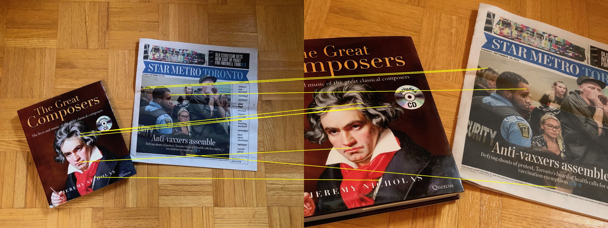

With three norm find the ten best matches:


From these 2 images and also the image in b) with 2 norm,  we could see that most matches are correct. And for one norm some matches with hair might be incorrect. Two norm will make the points same distance to another point, if these points are all lied on a circle with another point as the center. But for one norm, the points on the same circle might have difference value of one norm and three norm. That is one norm might loss some matches bacause of the larger distance than 2 norm is computed.

d)

Two noisy images with Gaussian random noise:


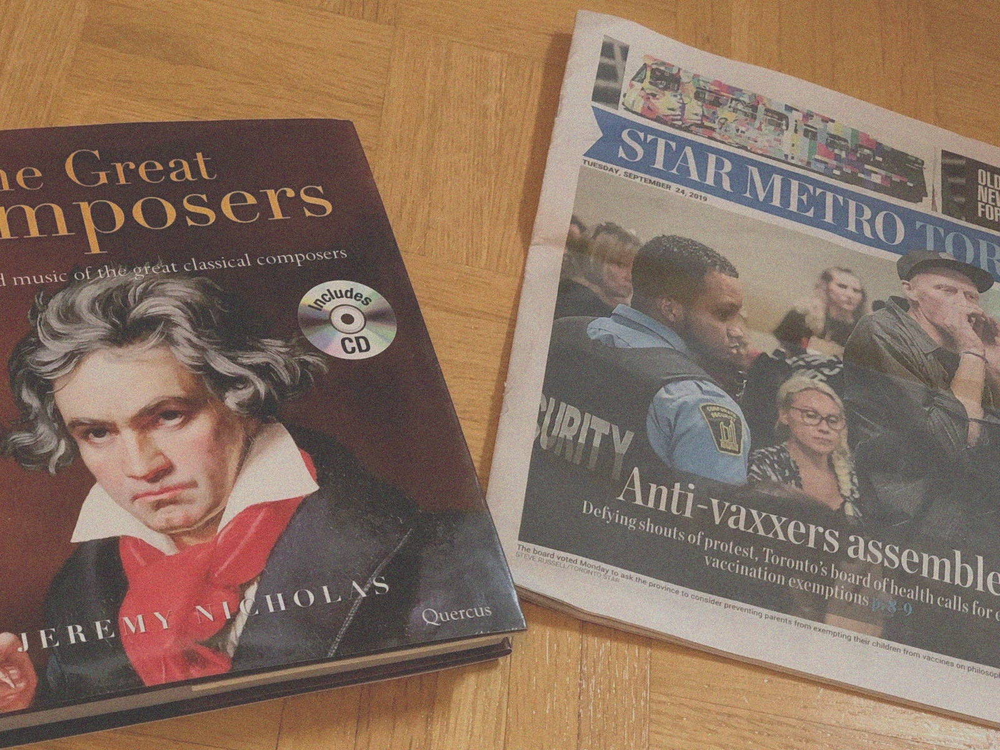

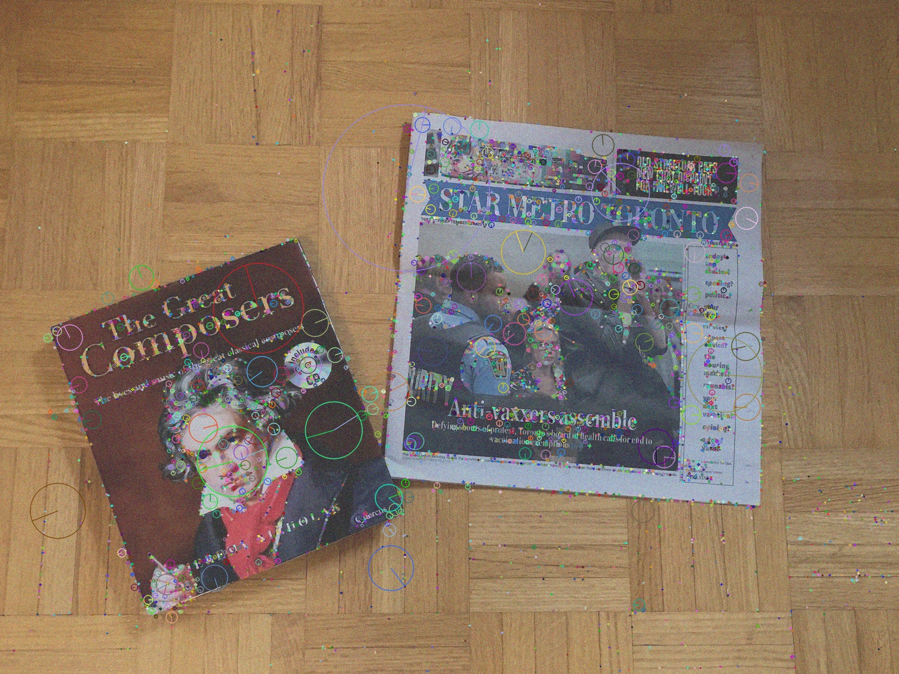


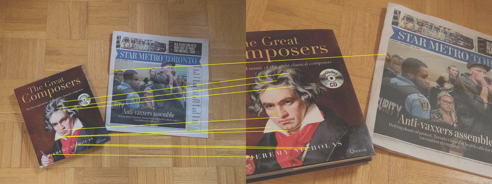

Noise may hide some keypoints and if we have a really strong noise some "signiture" feature might be messied and lose some really important features (e.g. faces in the image). And only a part of the feature could survive from this. And also if the individual noise points is really strong which has a really different intensity with surrounding pixels will be detected as a feature easily which are definitly not the feature points we want.

But even with match, there are still some correct matching between the images. With some small noises, strong feature keypoints will not be influenced a lot and the matches between them are still available. But because of the loss of keypoints, fewer correct matches may happened if a really strong noise is applied. And some really "strong" matches are also missed. And because of the noise points, some noise is detected as a feature point, then there may also have some error matching between them.

e)

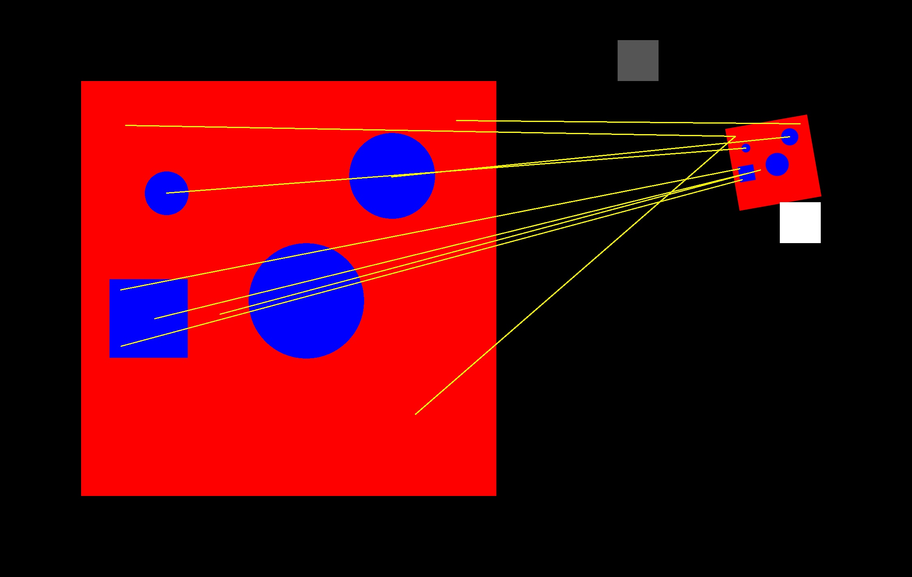

The build- in SIFT method could detect keypoints and features with a three channel images. With the 128 dimensional feature vector the function implemented in q4 b).